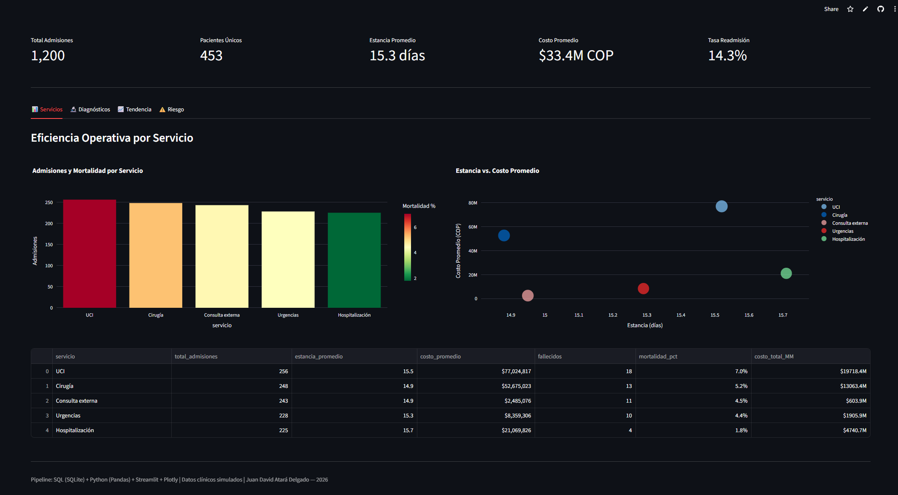

# 🏥 Clinical Data Pipeline & SQL Dashboard
### SQL · Python · ETL · Streamlit · IPS Colombia

[](https://python.org)
[](https://streamlit.io)
[](https://sqlite.org)
[](LICENSE)

---

## 📌 Overview

End-to-end clinical data pipeline simulating the operational analytics environment of a Colombian IPS (healthcare provider). The project covers synthetic data generation, relational database design, ETL automation, SQL-based KPI computation, and an interactive dashboard deployed on Streamlit Cloud.

> **Live dashboard:** [clinical-sql-pipeline.streamlit.app](https://jatarad-clinical-sql-pipeline.streamlit.app)

---

## 📊 Dashboard Preview



**5 clinical KPIs in real time:**
- Operational efficiency by service (UCI, Surgery, ER, Hospitalization)
- Patient profile by diagnosis with readmission rates
- Monthly admission trends and cost evolution
- Data quality metrics (completeness, validity)
- Risk scoring — top 20 high-risk patients

---

## 🔑 Key Results

| Metric | Value |
|--------|-------|
| Total patients | 500 |
| Total admissions | 1,200 |
| Lab results | 3,500 |
| Data completeness | 100% |
| UCI avg. cost | $77M COP/admission |
| Overall readmission rate | 14.3% |
| Top readmission diagnosis | ACV isquémico — 19.9% |

---

## 🗂️ Project Structure

```
Clinical-SQL-Pipeline/
├── notebooks/
│   ├── 01_generate_data.py      # Synthetic clinical dataset (Faker)
│   ├── 02_create_database.py    # SQLite DB creation + validation queries
│   └── 03_etl_analysis.py       # ETL pipeline + KPI computation
├── dashboard/
│   └── app.py                   # Streamlit interactive dashboard
├── data/
│   ├── raw/                     # Raw CSV files (gitignored)
│   └── processed/
│       ├── clinical_db.sqlite   # Relational database
│       ├── kpi_servicio.csv
│       ├── kpi_diagnostico.csv
│       ├── kpi_tendencia.csv
│       ├── kpi_riesgo_pacientes.csv
│       └── kpi_calidad.csv
└── requirements.txt
```

---

## ⚙️ Pipeline Architecture

```
Raw Data Generation          ETL Layer               Analytics Layer
──────────────────    ──────────────────────    ──────────────────────
Faker (synthetic)  →  SQLite (3 tables)      →  5 KPI modules
500 patients          10+ SQL queries            Risk scoring
1,200 admissions      JOIN, GROUP BY             Trend analysis
3,500 lab results     Window functions           Data quality check
                      Index optimization    →    Streamlit Dashboard
                                                 Plotly visualizations
```

---

## 🧮 SQL Highlights

The pipeline includes 10+ production-grade SQL queries:

```sql
-- Risk scoring with composite formula
SELECT
    p.patient_id,
    p.edad,
    p.diagnostico_principal,
    ROUND(
        (SUM(a.readmision) * 3) +
        (AVG(a.dias_estancia) * 0.5) +
        (p.edad * 0.1)
    , 1) AS risk_score
FROM patients p
JOIN admissions a ON p.patient_id = a.patient_id
GROUP BY p.patient_id
ORDER BY risk_score DESC;
```

```sql
-- Readmission rate by EPS (insurance provider)
SELECT
    p.eps,
    COUNT(a.admission_id)                     AS total_admisiones,
    ROUND(SUM(a.readmision)*100.0/COUNT(*),1) AS tasa_readmision_pct
FROM admissions a
JOIN patients p ON a.patient_id = p.patient_id
GROUP BY p.eps
ORDER BY tasa_readmision_pct DESC;
```

---

## 🚀 How to Run Locally

**1. Clone the repository**
```bash
git clone https://github.com/JataraD/Clinical-SQL-Pipeline.git
cd Clinical-SQL-Pipeline
```

**2. Create virtual environment**
```bash
python -m venv venv
venv\Scripts\activate        # Windows
source venv/bin/activate     # Mac/Linux
```

**3. Install dependencies**
```bash
pip install -r requirements.txt
```

**4. Run the pipeline**
```bash
python notebooks/01_generate_data.py
python notebooks/02_create_database.py
python notebooks/03_etl_analysis.py
```

**5. Launch dashboard**
```bash
streamlit run dashboard/app.py
```

Opens at `http://localhost:8501`

---

## 📦 Dependencies

```
pandas>=2.0.0
numpy>=1.24.0
sqlalchemy>=2.0.0
faker>=18.0.0
plotly>=5.0.0
streamlit>=1.30.0
openpyxl>=3.0.0
matplotlib>=3.7.0
```

---

## 🧠 Skills Demonstrated

`SQL` · `SQLite` · `ETL pipeline` · `data cleaning` · `data transformation` · `Python` · `Pandas` · `Streamlit` · `Plotly` · `dashboard design` · `KPI development` · `healthcare analytics` · `risk scoring` · `data quality` · `relational database` · `JOIN` · `GROUP BY` · `window functions` · `index optimization` · `cloud deployment`

---

## 👤 Author

**Juan David Atará Delgado**
Bioengineering | MSc Computational Biology (in progress) — Universidad de Los Andes
📧 juan.atara99@gmail.com · 🔗 [linkedin/juanatara](https://linkedin.com/in/juanatara)

---

*Simulated clinical data — no real patient information used | May 2026*
